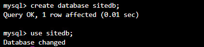
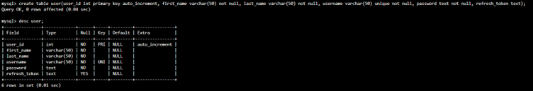
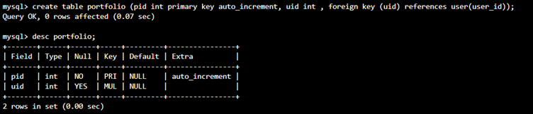
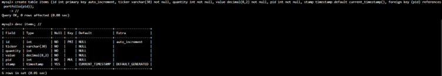
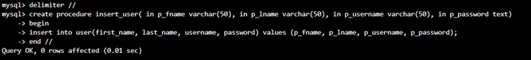
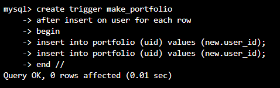
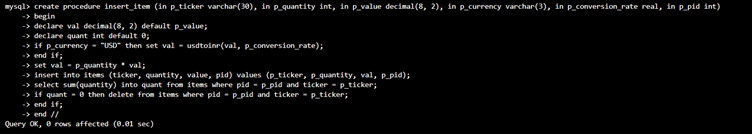
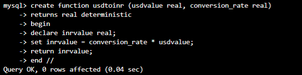

1. ```
    mysql> create database sitedb;
    mysql> use sitedb;
   ```
   
 
2. ```
    mysql> create table user(user_id int primary key auto_increment, first_name varchar(50) not null, last_name varchar(50) not null, username varchar(50) unique not null, password text not null, refresh_token text);
    mysql> desc user;
   ```
   
   
3. ```
    mysql> create table portfolio
        -> (pid int primary key auto_increment, uid int , foreign key (uid) references user(user_id));
    mysql> desc portfolio;
   ```
   
   
4. ```
    mysql> create table items (id int primary key auto_increment, ticker varchar(30) not null, quantity int not null, value decimal(8,2) not null, pid int not null, stamp timestamp default current_timestamp(), foreign key (pid) references portfolio(pid) ); 
    mysql> desc items;
   ```
   
   
5. ```
    mysql> delimiter //
    mysql> create procedure insert_user( in p_fname varchar(50), in p_lname varchar(50), in p_username varchar(50), in p_password text)
        -> begin
        -> insert into user(first_name, last_name, username, password) values (p_fname, p_lname, p_username, p_password);
        -> end //
   ```
   
 
6. Upon new user entry there should be two insertions in the portfolio table. Assigning two portfolios - trigger.
   ```
    mysql> create trigger make_portfolio
        -> after insert on user for each row
        -> begin
        -> insert into portfolio (uid) values (new.user_id);
        -> insert into portfolio (uid) values (new.user_id);
        -> end //
   ```
   
   
7. Procedure to insert item: idea->delete all info of a ticker when the quantity becomes zero.
   ```
    mysql> create procedure insert_item (in p_ticker varchar(30), in p_quantity int, in p_value decimal(8, 2), in p_currency varchar(3), in p_conversion_rate real, in p_pid int)
        -> begin
        -> declare val decimal(8, 2) default p_value;
        -> declare quant int default 0;
        -> if p_currency = "USD" then set val = usdtoinr(val, p_conversion_rate);
        -> end if;
        -> set val = p_quantity * val;
        -> insert into items (ticker, quantity, value, pid) values (p_ticker, p_quantity, val, p_pid);
        -> select sum(quantity) into quant from items where pid = p_pid and ticker = p_ticker;
        -> if quant = 0 then delete from items where pid = p_pid and ticker = p_ticker;
        -> end if;
        -> end // 
   ```
   
   
8. Function to calculate usd to inr : paramameters are usd value and conversion_rate(how many rs is one dollar).
   ```
    mysql> create function usdtoinr (usdvalue real, conversion_rate real)       
        -> returns real deterministic
        -> begin
        -> declare inrvalue real;   
        -> set inrvalue = conversion_rate * usdvalue;
        -> return inrvalue;
        -> end //
   ```
   
